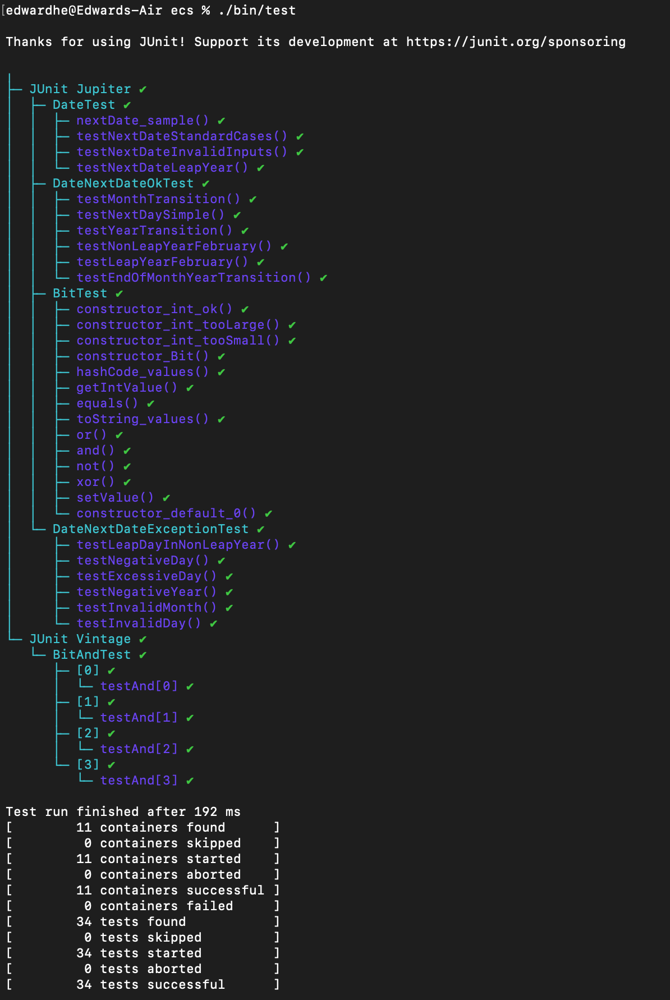

# Date Class Tests

This README provides an overview of the unit tests for the `Date` class, which includes methods to manipulate and handle dates correctly, including calculating the next day of a given date. The tests are organized into three separate classes to ensure thorough testing and clear separation of concerns.

## Exercise 1

### Table

|      Test Case       | Expected Result | Actual Result | Verdict |
|:--------------------:|:---------------:|:-------------:|:-------:|
| constructor_int_ok   | Pass            | Pass          | Pass    |
| constructor_int_tooLarge | Pass        | Pass          | Pass    |
| constructor_int_tooSmall | Pass        | Pass          | Pass    |
| constructor_Bit      | Pass            | Pass          | Pass    |
| hashCode_values      | Pass            | Pass          | Pass    |
| getIntValue          | Pass            | Pass          | Pass    |
| equals               | Pass            | Pass          | Pass    |
| toString_values      | Pass            | Pass          | Pass    |
| or                   | Pass            | Pass          | Pass    |
| and                  | Pass            | Pass          | Pass    |
| not                  | Pass            | Pass          | Pass    |
| xor                  | Pass            | Pass          | Pass    |
| setValue             | Pass            | Pass          | Pass    |
| constructor_default_0| Pass            | Pass          | Pass    |

## Exercise 2

### Test Classes

#### Final Result

1. **DateTest**
   - This class contains basic tests for the `Date` class.
   - It includes tests for basic functionality, such as calculating the next day, handling month and year transitions, and dealing with leap years.
   - Tests also include checking for exception handling with invalid inputs.

2. **DateNextDateOkTest**
   - Focuses solely on scenarios where the `nextDate` method is expected to succeed.
   - This includes day-to-day transitions, end-of-month transitions, end-of-year transitions, and correct handling of leap and non-leap years.

3. **DateNextDateExceptionTest**
   - Specifically tests cases where the `nextDate` method is expected to throw exceptions.
   - These tests cover scenarios such as invalid day numbers, invalid month numbers, negative values for year or day, and other scenarios where input data is not valid.