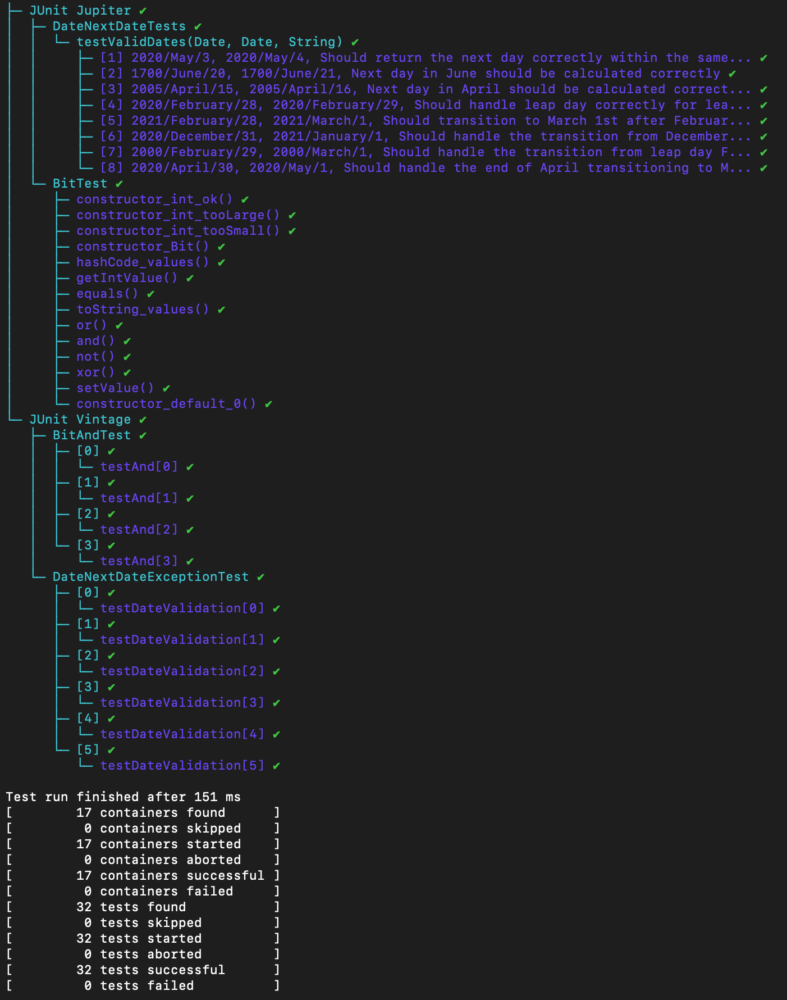

# Date Class Tests

This README provides an overview of the unit tests for the `Date` class, which includes methods to manipulate and handle dates correctly, including calculating the next day of a given date. The tests are organized into three separate classes to ensure thorough testing and clear separation of concerns.

## Exercise 1

### Table
|      Test Case       |                      Expected Result                     |                 Actual Result                 | Verdict |
|:--------------------:|:--------------------------------------------------------:|:--------------------------------------------:|:-------:|
| UserName: Edward12   | Registration succeeds (UserName meets all requirements). | Registration succeeds (UserName is valid).   |  Pass   |
| UserName: ed         | Error: UserName too short.                               | Error: UserName too short.                   |  Pass   |
| UserName: 1234567890123 | Error: UserName starts with a digit and is too long.   | Error: UserName starts with a digit and is too long. | Pass |
| FirstName: John      | Registration succeeds (FirstName meets requirements).   | Registration succeeds (FirstName is valid).  |  Pass   |
| FirstName: 123Anne   | Error: FirstName starts with a digit.                    | Error: FirstName starts with a digit.        |  Pass   |
| FirstName: Anne-Marie| Error: FirstName contains invalid character '-'.        | Error: FirstName contains invalid character '-'. | Pass  |
| Age: 18              | Registration succeeds (Age is minimum valid age).        | Registration succeeds (Age is 18).           |  Pass   |
| Age: 64              | Registration succeeds (Age is maximum valid age).        | Registration succeeds (Age is 64).           |  Pass   |
| Age: 17              | Error: Age is below minimum requirement.                 | Error: Age is below minimum requirement.     |  Pass   |
| Age: 65              | Error: Age is above maximum requirement.                 | Error: Age is above maximum requirement.     |  Pass   |
| Email: example@gmail.com | Registration succeeds (Email format is correct).     | Registration succeeds (Email format is correct). | Pass  |
| Email: example@com   | Error: Email domain format is incorrect.                 | Error: Email domain format is incorrect.     |  Pass   |
| Email: examplegmail.com | Error: Email missing '@'.                             | Error: Email missing '@'.                    |  Pass   |
| City: Ottawa         | Registration succeeds (City is listed).                  | Registration succeeds (City is Ottawa).      |  Pass   |
| City: New York       | Error: City not listed.                                  | Error: City not listed.                      |  Pass   |
| Postal Code: A1B 2C3 | Registration succeeds (Postal code format is correct).   | Registration succeeds (Postal code format is correct). | Pass |
| Postal Code: A1B2C3  | Registration succeeds (Postal code format is correct).   | Registration succeeds (Postal code format is correct). | Pass |
| Postal Code: D1F2G3  | Error: Postal Code uses restricted letters.              | Error: Postal Code uses restricted letters.  |  Pass   |
| Postal Code: A1 B2C3 | Error: Incorrect placement of optional space.            | Error: Incorrect placement of optional space. |  Pass   |

## Exercise 2

### Test Classes

#### Final Result

1. **DateTest**
   - This class contains basic tests for the `Date` class.
   - It includes tests for basic functionality, such as calculating the next day, handling month and year transitions, and dealing with leap years.
   - Tests also include checking for exception handling with invalid inputs.

2. **DateNextDateOkTest**
   - Focuses solely on scenarios where the `nextDate` method is expected to succeed.
   - This includes day-to-day transitions, end-of-month transitions, end-of-year transitions, and correct handling of leap and non-leap years.

3. **DateNextDateExceptionTest**
   - Specifically tests cases where the `nextDate` method is expected to throw exceptions.
   - These tests cover scenarios such as invalid day numbers, invalid month numbers, negative values for year or day, and other scenarios where input data is not valid.