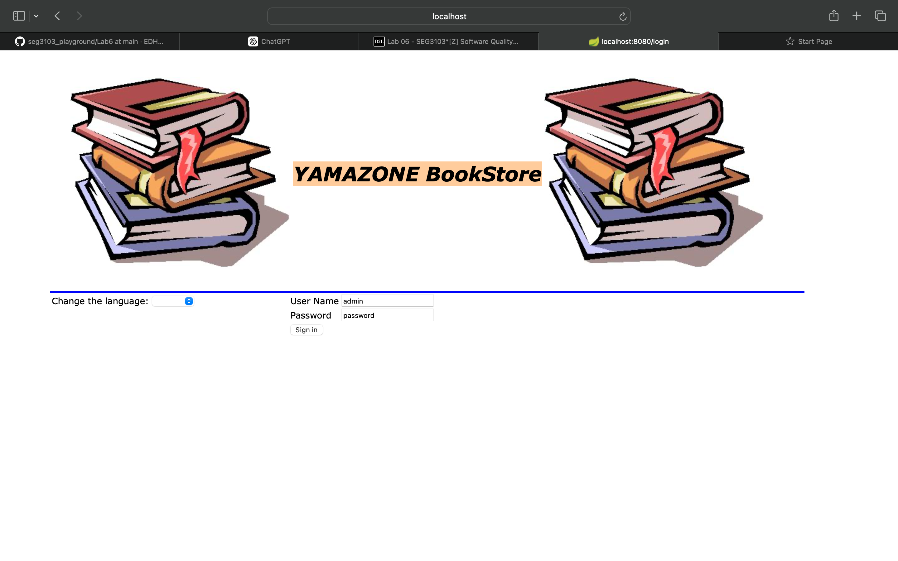

# seg3103_playground
## Lab 06


### Part 1: Setup


### Part 2: Run Application

run `mvn package -DskipTests` and `java -jar ./target/BookstoreApp-0.1.0.jar`.


Application


`mvn test`


### Part 3: Additional Testing

```
@Test
  public void test3() {
    driver.get("http://localhost:8080/admin");

    WebElement userID = driver.findElement(By.id("loginId"));
    userID.sendKeys("admin");
    WebElement loginPassword = driver.findElement(By.id("loginPasswd"));
    loginPassword.sendKeys("password");
    WebElement logIn = driver.findElement(By.id("loginBtn"));
    logIn.click();

    String actualUrl="http://localhost:8080/admin";
    String expectedUrl= driver.getCurrentUrl();
    assertEquals(expectedUrl, actualUrl);

  }
```

Result


