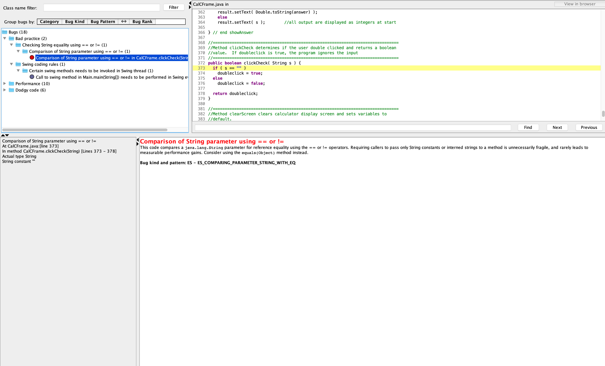
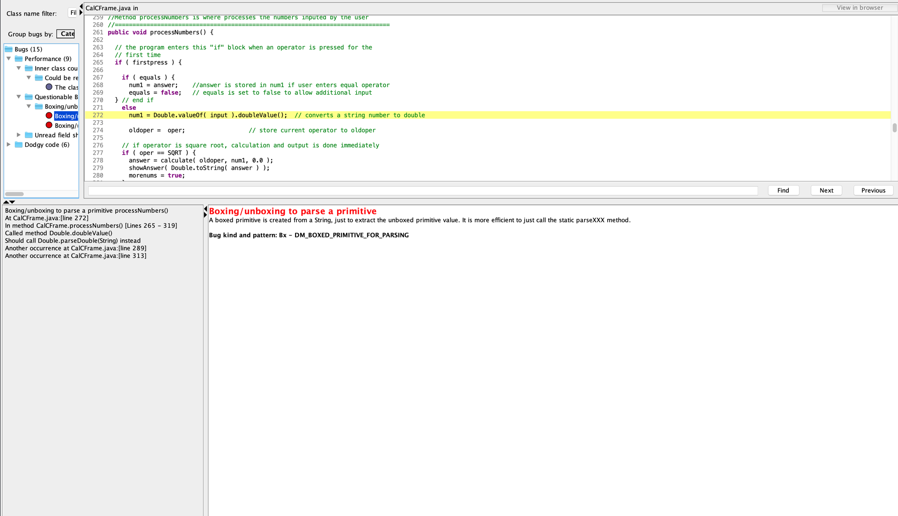
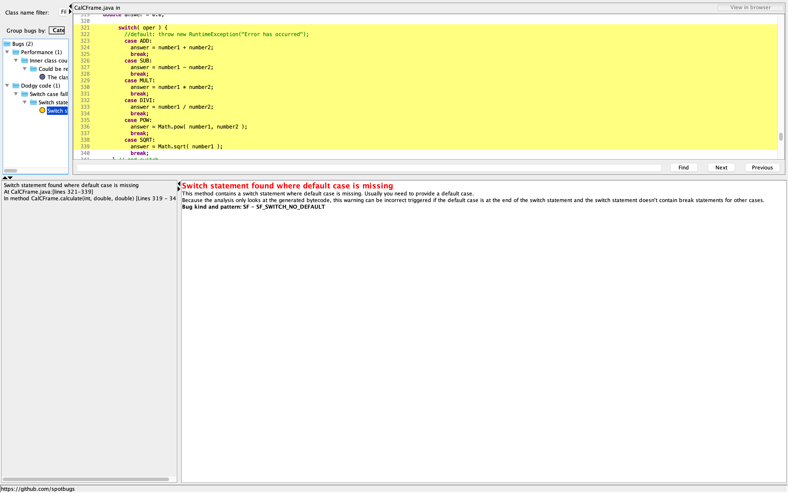

# LAB 7

### SETUP

Running

`javac -encoding UTF-8 --source-path src -d dist src/*.java.`

`javac -encoding UTF-8 --source-path test -d dist -cp dist:lib/junit-platform-console-standalone-1.7.1.jar test/*.java`

Then run

`java -cp ./dist Main` and `java -jar ./lib/spotbugs/lib/spotbugs.jar` for SpotBugs.

The images of running application:

Creating a new project:

The screenshot below shows SpotBugs with a total of 18 bugs:

### Bug 1: Comparison of String parameter using == or !=

Fix:

### Bug 2: Certain swing methods needs to be invoked in Swing thread

Fix:

In the main method, the isVisible() Swing method is being called which could cause deadlocks or other threading issues since Java Swing components are not thread-safe in Java. The SwingUtilities.invokeLater() method delays the GUI creation task until the initial thread's tasks have been completed and will then ensure the GUI creation takes place inside the method for the thread.

### Bug 3: Could be refactored into a named static inner class

To fix the code, I would create a WindowAdapter class within the CalCFrame class and in the CalCFrame method would call WindowAdapter.WindowClosing(WindowEvent e), passing in a WindowEvent as as argument, instead of creating a new WindowAdapter.

### Bug 4: Private method is never called

Fix:

### Bugs 5 and 6: Boxing/unboxing to parse a primitive

Fix:

### Bugs 7-12: Unread field: should this field be static?:

Fix:

### Bug 13: Method uses the same code for two branches:

Fix:

### Bug 14: Switch statement found where default case is missing

Fix:

### Bugs 15-18: Condition has no effect
Below are screenshots of the bug before making the changes:

These are screenshots of the fixed bugs.

After fixing 17 bugs, the screenshot below shows the updated SpotBug errors:

